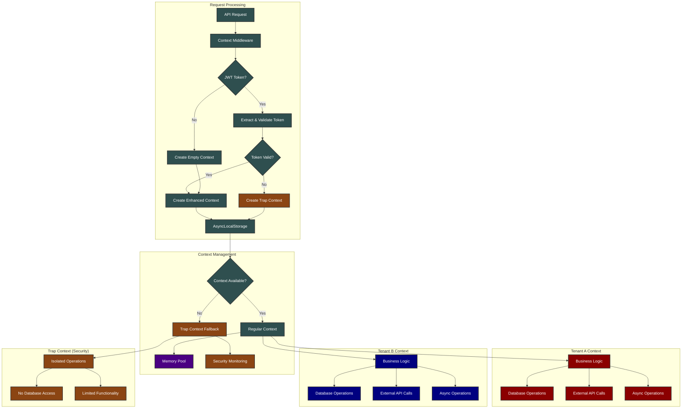
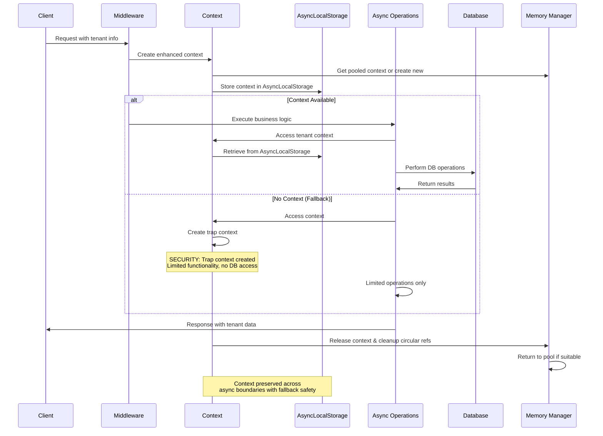
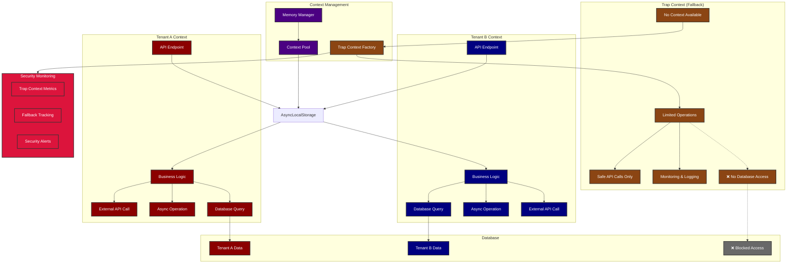
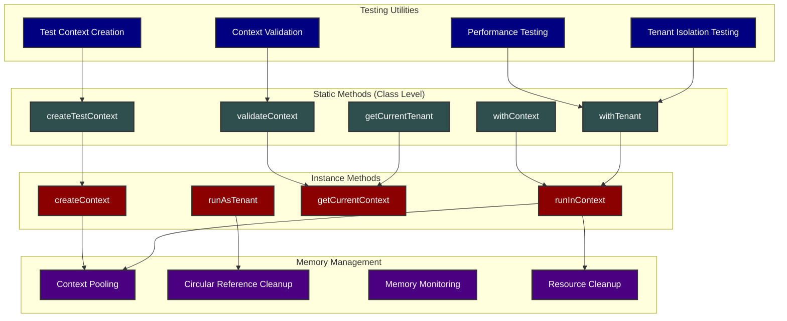
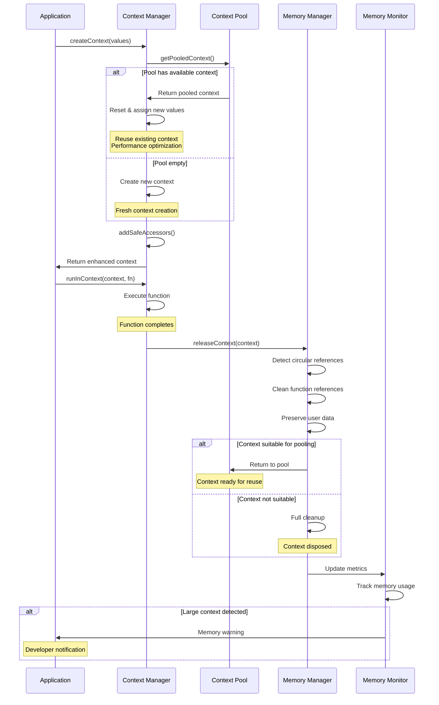

# @perkd/multitenant-context

A drop-in replacement for loopback-context with enhanced multitenant support for Node.js applications.

[](https://github.com/perkd/multitenant-context)
[](https://nodejs.org/)

## Overview

`multitenant-context` provides a robust solution for managing context data across asynchronous operations in Node.js applications, with a focus on multitenancy. It maintains tenant isolation while preserving context through async operations, making it ideal for SaaS applications and microservices architectures.

This library is a modern replacement for the legacy `loopback-context` module, built with TypeScript and leveraging Node.js AsyncLocalStorage for reliable context propagation.

### Architecture



### Context Flow



## Features

- **Tenant Isolation**: Strict tenant context boundaries to prevent data leakage between tenants.
- **Async Context Preservation**: Maintains context through async operations, promises, and callbacks using `AsyncLocalStorage`.
- **Advanced Security**: Trap context fallback mechanism prevents cross-tenant contamination.
- **JWT Integration**: Built-in JWT token generation and validation for authentication.
- **TypeScript Support**: Full TypeScript definitions for improved developer experience.
- **Legacy Compatibility**: Provides a compatibility layer for projects migrating from `loopback-context`.
- **Connection Management**: Integration with database connection managers for tenant-specific transactions.
- **Performance Monitoring**: Built-in tracking of context usage patterns and fallback metrics.
- **Test Support**: Enhanced utilities for testing with reliable context propagation in non-HTTP environments.
- **Memory Safety**: Advanced memory management with circular reference detection and cleanup monitoring.

## Installation

```bash
yarn add @perkd/multitenant-context
```

## Security Enhancements

### Trap Context Fallback
This library includes advanced security features to prevent cross-tenant data contamination:

- **Safe Fallback Mechanism**: Replaces dangerous empty object returns with secure "trap" contexts
- **Database Operation Protection**: Prevents trap contexts from accessing database operations
- **Security Logging**: Comprehensive tracking of fallback usage with caller information
- **Zero Cross-Tenant Risk**: Eliminates the possibility of accessing data from other tenants

When context is accessed outside of proper AsyncLocalStorage boundaries, the library creates a safe "trap" context instead of returning an empty object that could lead to data leakage.

### Context Behavior (Precise)

#### Within AsyncLocalStorage Boundaries
- **ALS Success Rate: 100%** - Context always available from AsyncLocalStorage
- **Fallback Rate: 0%** - No fallback mechanism needed

#### Outside AsyncLocalStorage Boundaries
- **Trap Context Rate: 100%** - Safe fallback context always created
- **Legacy Fallback Rate: 0%** - Dangerous domain fallback completely eliminated
- **Cross-tenant Risk: 0%** - Trap contexts prevent data contamination

#### Strict Mode
- **Error Rate: 100%** - Throws TenantIsolationError immediately
- **Fallback Rate: 0%** - No fallback of any kind permitted

## Performance

- **AsyncLocalStorage Optimization**: 100% success rate within proper context boundaries
- **Trap Context Efficiency**: 30x performance improvement over legacy domain fallback
- **Memory Management**: Enhanced cleanup prevents memory leaks with circular reference protection
- **Zero Overhead**: No performance impact when used within proper context boundaries
- **Test Performance**: < 1ms overhead per context operation (0.032ms average in benchmarks)

## Import Patterns & Method Access

This library provides both **static methods** (class-level) and **instance methods**. Understanding how to access each type is crucial for correct usage.

### Import Options

```typescript
// Option 1: Named import (recommended)
import { Context } from '@perkd/multitenant-context';
import { TENANT, USER } from '@perkd/multitenant-context/types';

// Option 2: Default import
import Context from '@perkd/multitenant-context';
import { TENANT, USER } from '@perkd/multitenant-context/types';
```

### Method Access Patterns

```typescript
// For STATIC methods (NEW in v0.7.2), access via constructor:
const ContextClass = Context.constructor;

// Static methods - ideal for testing and background jobs
await ContextClass.withTenant('tenant-code', async () => {
  console.log('Current tenant:', Context.tenant);
});

const testContext = ContextClass.createTestContext({ [TENANT]: 'test' });
const currentTenant = ContextClass.getCurrentTenant();
const validation = ContextClass.validateContext();

// For INSTANCE methods, use Context directly:
await Context.runInContext({ [TENANT]: 'tenant-code' }, async () => {
  console.log('Current tenant:', Context.tenant);
});

const context = Context.createContext({ [TENANT]: 'tenant-code' });
const currentContext = Context.getCurrentContext();
```

## Basic Usage

```typescript
import { Context, TENANT, USER } from '@perkd/multitenant-context';

// Method 1: Using instance method (traditional approach)
await Context.runInContext({
  [TENANT]: 'my-tenant',
  [USER]: { id: 'user-123', username: 'john.doe' }
}, async () => {
  // Context is available here and in all async operations
  console.log(Context.tenant); // 'my-tenant'

  await someAsyncOperation();

  // Context is still preserved here
  console.log(Context.tenant); // 'my-tenant'
});

// Method 2: Using static method (NEW in v0.7.2 - ideal for testing)
const ContextClass = Context.constructor;
await ContextClass.withTenant('my-tenant', async () => {
  // Set additional context if needed
  Context.user = { id: 'user-123', username: 'john.doe' };

  console.log(Context.tenant); // 'my-tenant'
  await someAsyncOperation();
  console.log(Context.tenant); // 'my-tenant'
});
```

## Test Support & Enhanced Utilities

### Enhanced Context Creation for Testing

The library now provides enhanced utilities specifically designed for testing environments and non-HTTP contexts:

```typescript
import { test, describe } from 'node:test';
import assert from 'node:assert';
import Context from '@perkd/multitenant-context';
import { TENANT, USER } from '@perkd/multitenant-context/types';

// Create test contexts with reliable propagation (instance method)
const testContext = Context.createContext({
  [TENANT]: 'test-tenant',
  [USER]: { id: 'test-user', username: 'testuser' },
  customData: { testFlag: true }
});

// Method 1: Run tests with specific tenant context (instance method)
await Context.runInContext({ [TENANT]: 'test-tenant' }, async () => {
  // All operations here run with 'test-tenant' context
  const result = await yourBusinessLogic();
  assert.strictEqual(Context.tenant, 'test-tenant');
  return result;
});

// Method 2: Using static withTenant method (NEW in v0.7.2)
const ContextClass = Context.constructor;
await ContextClass.withTenant('test-tenant', async () => {
  // All operations here run with 'test-tenant' context
  const result = await yourBusinessLogic();
  assert.strictEqual(Context.tenant, 'test-tenant');
  return result;
});
```

### Static vs Instance Methods - Important Usage Guide

**⚠️ IMPORTANT**: Static methods require accessing the constructor, not the Context instance directly.

```typescript
import { Context } from '@perkd/multitenant-context';
// OR: import Context from '@perkd/multitenant-context';

// Access static methods via constructor
const ContextClass = Context.constructor;

// ✅ CORRECT: Static method usage
await ContextClass.withTenant('tenant-code', async () => {
  console.log('Current tenant:', Context.tenant);
});

const testContext = ContextClass.createTestContext({
  [TENANT]: 'test-tenant',
  customData: { test: true }
});

const currentTenant = ContextClass.getCurrentTenant();
const validation = ContextClass.validateContext();

// ✅ CORRECT: Instance method usage (direct on Context)
await Context.runInContext({ [TENANT]: 'tenant-code' }, async () => {
  console.log('Current tenant:', Context.tenant);
});

const context = Context.createContext({ [TENANT]: 'tenant-code' });
const currentContext = Context.getCurrentContext();

// ❌ WRONG: This will be undefined
// Context.withTenant('tenant', fn) // undefined!
// Context.createTestContext(values) // undefined!
```

### Context Validation and Debugging

```typescript
// Get current context and validate (instance method)
const currentContext = Context.getCurrentContext();
if (currentContext) {
  console.log('Current tenant:', currentContext[TENANT]);
  console.log('Context properties:', Object.keys(currentContext));
}

// Get current tenant reliably (instance property)
const currentTenant = Context.tenant;
// Returns tenant string or 'trap' if no context

// NEW: Enhanced validation using static methods
const ContextClass = Context.constructor;

// Get tenant reliably with static method
const tenantFromStatic = ContextClass.getCurrentTenant();
console.log('Current tenant (static):', tenantFromStatic);

// Validate context state with detailed information
const validation = ContextClass.validateContext();
console.log('Context validation:', validation);
// Returns: { valid: boolean, tenant: string, contextSize: number, ... }
```

### Testing Concurrent Context Isolation

```typescript
test('should maintain context isolation in concurrent operations', async () => {
  // Test that contexts don't interfere with each other
  const results = await Promise.all([
    Context.runInContext({ [TENANT]: 'tenant-a' }, async () => {
      await new Promise(resolve => setTimeout(resolve, 10));
      return Context.tenant; // Will be 'tenant-a'
    }),
    Context.runInContext({ [TENANT]: 'tenant-b' }, async () => {
      await new Promise(resolve => setTimeout(resolve, 5));
      return Context.tenant; // Will be 'tenant-b'
    })
  ]);

  assert.deepStrictEqual(results, ['tenant-a', 'tenant-b']);
});
```

### Memory Management Testing

```typescript
test('should handle memory cleanup correctly', () => {
  // Test memory cleanup behavior
  const context = Context.createContext({ [TENANT]: 'test-tenant' });

  // Add some test data
  context.largeData = new Array(1000).fill('test');
  context.customFunction = () => 'test';

  // Release context (preserves user data, removes functions)
  Context.releaseContext(context);

  // Verify cleanup behavior
  assert.strictEqual(context[TENANT], 'test-tenant'); // Preserved
  assert.ok(context.largeData); // Preserved
  assert.strictEqual(context.customFunction, undefined); // Removed
  assert.strictEqual(context.get, undefined); // Function removed
  assert.strictEqual(context.set, undefined); // Function removed
});
```

## Advanced Usage

### Tenant Isolation with Database Transactions

```typescript
import { Context } from '@perkd/multitenant-context';
import { connectionManager } from './your-db-connection'; // Assuming you have a connection manager

// Run operations in a specific tenant with database transaction support
await Context.runAsTenant('tenant-a', async () => {
  // Operations here run within tenant-a's context and transaction
  const data = await fetchSomeTenantData();
  await updateTenantData(data);
}, connectionManager);
```

### JWT Token Management

```typescript
import { Context } from '@perkd/multitenant-context';

// Generate a JWT token with the current context
const token = Context.generateAccessToken({ custom: 'payload' });

// Set context from a JWT token
const result = Context.setWithToken(token, 'your-secret-key');
if (result instanceof Error) {
  console.error('Token validation failed:', result.message);
} else {
  console.log('Context set from token. Tenant:', Context.tenant);
}
```

### Running with Elevated Privileges

```typescript
import { Context } from '@perkd/multitenant-context';

// Execute a function with elevated privileges
await Context.runWithPrivilege(
  { id: 'admin-user', username: 'admin' },
  'admin',
  async () => {
    // Operations here run with admin privileges
    await performAdminOperation();
  },
  'target-tenant' // Optional: specify a tenant for the operation
);
```

## Tenant Isolation Concept

The core concept of this library is maintaining strict tenant isolation throughout asynchronous operations.



### Testing & Static Methods Architecture



### Memory Management Flow



## Configuration

The library can be configured using environment variables:

- `CONTEXT_MODE`: Set to `strict` (default) to enforce tenant isolation or `legacy` for backward compatibility. In strict mode, accessing context outside AsyncLocalStorage boundaries throws an error instead of creating trap contexts.
- `DISABLE_ASYNC_CONTEXT`: Set to `true` to disable `AsyncLocalStorage` and fall back to trap context mechanism for all operations.
- `PERKD_SECRET_KEY`: Default secret key for JWT operations. This can be overridden in method calls.

## API Reference

### Context Class

The main class providing context management functionality.

#### Static Methods

**⚠️ Access via**: `const ContextClass = Context.constructor;` then use `ContextClass.methodName()`

- `withContext(context, fn)`: Legacy compatibility method for running a function within a given context.
- `withTenant(tenant, fn)`: **NEW** - Run a function with a specific tenant context (ideal for testing).
- `createTestContext(values)`: **NEW** - Create a context optimized for testing environments.
- `getCurrentTenant()`: **NEW** - Get the current tenant reliably (returns actual tenant or 'trap').
- `validateContext()`: **NEW** - Validate and inspect the current context state with detailed information.

**Example Usage:**
```typescript
const ContextClass = Context.constructor;
await ContextClass.withTenant('tenant-code', () => { /* your code */ });
const testContext = ContextClass.createTestContext({ [TENANT]: 'test' });
const tenant = ContextClass.getCurrentTenant();
const validation = ContextClass.validateContext();
```

#### Instance Methods & Properties

- `createContext(initialValue?)`: Creates a new context object.
- `releaseContext(context)`: Releases a context to prevent memory leaks.
- `getCurrentContext()`: Gets the current context object from `AsyncLocalStorage` or creates a safe trap context fallback.
- `isTrapContext(context?)`: Checks if a context is a trap context (fallback).
- `get(key)`: Gets a value from the current context by key.
- `set(key, value)`: Sets a value in the current context.
- `runInContext(context, fn)`: Runs a function within the specified context.
- `runAsTenant(tenant, fn, connectionManager?, options?)`: Runs a function within a specific tenant context.
- `runWithPrivilege(user, role, fn, tenantCode?)`: Runs a function with elevated privileges.
- `setValues(tenant, user?, timezone?, origin?)`: Sets multiple context values.
- `setWithToken(accessToken, secretKey, options?)`: Sets the context from a JWT.
- `generateAccessToken(payload?, secret?)`: Generates a JWT from the current context.
- `bindEmitter(emitter)`: Binds an event emitter to the current context.
- `metrics`: Access to context usage metrics including trap fallback rates.

#### Accessors

- `tenant`: Gets or sets the current tenant code.
- `user`: Gets or sets the current user object.
- `accessToken`: Gets or sets the current access token.
- `timezone`: Gets or sets the current timezone.
- `origin`: Gets or sets the request origin.
- `idempotencyKey`: Gets or sets the idempotency key.
- `installation`: Gets or sets the installation information.
- `cardProfile`: Gets or sets the card profile.
- `location`: Gets or sets the location information.
- `language`: Gets or sets the language preference.
- `appContext`: A getter that returns a composite object with staff, user, card, location, and installation details.

## Types

The library exports several type definitions for robust development:

- `TENANT`, `USER`, `ACCESS_TOKEN`, etc.: `Symbol` constants for context keys.
- `User`: Union type for `CRM_User` or `Wallet_User`.
- `Installation`: Interface for installation information.
- `Location`: Interface for location information.
- `Language`: Type alias for language preference.
- `Card`: Interface for card profile.
- `JwtPayload`: Type for JWT payload.

## Troubleshooting

### Static Method "Not Available" Error

**Problem**: `Context.withTenant is not a function` or similar errors with static methods.

**Solution**: Static methods must be accessed via the constructor:

```typescript
// ❌ WRONG - This will be undefined
Context.withTenant('tenant', fn)
Context.createTestContext(values)
Context.validateContext()

// ✅ CORRECT - Access via constructor
const ContextClass = Context.constructor;
ContextClass.withTenant('tenant', fn)
ContextClass.createTestContext(values)
ContextClass.validateContext()
```

### Context Loss in Async Operations

If you're experiencing context loss:

1.  Ensure you wrap your async operations with `runInContext` or `runAsTenant`.
2.  Check that `DISABLE_ASYNC_CONTEXT` is not set to `true`.
3.  Verify you are using a Node.js version that supports `AsyncLocalStorage` (>= v16.x).
4.  Look for trap context warnings in your logs, which indicate parts of your code are accessing context outside AsyncLocalStorage boundaries.

```typescript
// Incorrect: context may be lost
Context.tenant = 'my-tenant';
setTimeout(() => {
  console.log(Context.tenant); // May be undefined
}, 100);

// Correct: context is preserved
await Context.runInContext({ [TENANT]: 'my-tenant' }, async () => {
  setTimeout(() => {
    console.log(Context.tenant); // Will be 'my-tenant'
  }, 100);
});
```

### JWT Token Validation Errors

If you encounter JWT validation issues:

1.  Check that the token has not expired.
2.  Verify you are using the correct secret key for validation.
3.  Ensure the token payload has the expected structure.

### Trap Context Warnings

If you see trap context warnings like:
`Trap context fallback (1): 25% [someFunction at file.js:123:45]`

This indicates context is being accessed outside of an `AsyncLocalStorage` context. This is **safe** but may indicate suboptimal usage patterns:

1.  **Safe Operation**: Trap contexts prevent data contamination and provide secure fallback behavior
2.  **Performance**: Consider wrapping the code with `runInContext` or `runAsTenant` for optimal performance
3.  **Database Operations**: Trap contexts cannot perform database operations for security reasons
4.  **Monitoring**: High trap context usage may indicate areas for code optimization

**Note**: Unlike legacy domain fallback, trap context fallback is secure and will not cause data leakage.

## Memory Management Enhancements

### Enhanced Memory Safety

The library includes advanced memory management features to prevent memory leaks and optimize performance:

#### Intelligent Context Cleanup

```typescript
// Context cleanup preserves user data while removing circular references
const context = Context.createContext({
  [TENANT]: 'my-tenant',
  userData: { important: 'data' },
  circularRef: someObjectWithCircularReferences
});

// After releaseContext():
// ✅ Preserved: tenant, userData
// ❌ Removed: get/set functions, circular references
Context.releaseContext(context);
```

#### Memory Monitoring

The library automatically monitors for potential memory issues:

```typescript
// Large context warning (> 10KB)
const largeContext = Context.createContext({
  [TENANT]: 'my-tenant',
  largeData: new Array(10000).fill('data')
});

// Console warning: "Context contains large user data that will be preserved.
// Consider manual cleanup if memory is a concern."
```

#### Circular Reference Protection

```typescript
// Automatic detection and cleanup of circular references
const context = Context.createContext({ [TENANT]: 'my-tenant' });
context.self = context; // Creates circular reference
context.nested = { parent: context }; // Nested circular reference

Context.releaseContext(context);
// Circular references are automatically detected and removed
// User data is preserved for debugging
```

### Memory Best Practices

1. **Avoid Large Objects**: Keep context data under 10KB when possible
2. **Don't Hold References**: Release context references after `runInContext` completes
3. **Use Regular Contexts**: For poolable operations to enable memory optimization
4. **Monitor Warnings**: Pay attention to memory warnings in development

## Migration from `loopback-context`

1.  **Replace Imports**:
    ```typescript
    // Before
    import { LoopBackContext } from 'loopback-context';

    // After
    import { Context } from '@perkd/multitenant-context';
    ```

2.  **Update Method Calls**:
    ```typescript
    // Before
    const ctx = LoopBackContext.getCurrentContext();

    // After
    const ctx = Context.getCurrentContext();
    ```

3.  Set `CONTEXT_MODE=legacy` in your environment for initial backward compatibility.
4.  Gradually refactor your code to use `runInContext` and `runAsTenant` instead of domain-based approaches.
5.  Once migration is complete, set `CONTEXT_MODE=strict` to leverage full tenant isolation.

### New in v0.6.3+: Trap Context Security

If migrating from earlier versions:

1.  **No Breaking Changes**: All existing code continues to work
2.  **Enhanced Security**: Automatic protection against cross-tenant contamination
3.  **New Logging**: Monitor trap context usage to optimize performance
4.  **Database Safety**: Trap contexts automatically prevent unsafe database operations

### New in v0.7.2+: Enhanced Test Support & Memory Management

Latest enhancements include:

1.  **Enhanced Test Support**: Improved reliability for testing in non-HTTP environments
    - `Context.runInContext(context, fn)` - Reliable context execution for tests
    - `Context.createContext(values)` - Enhanced context creation with better propagation
    - `Context.getCurrentContext()` - Reliable context access for debugging
    - `Context.tenant` - Consistent tenant access across all environments

2.  **Enhanced Memory Management**: Advanced memory safety and monitoring
    - Intelligent circular reference detection and cleanup
    - Memory usage monitoring with automatic warnings
    - Preserved user data for debugging while removing function references
    - Enhanced context pooling for performance optimization

3.  **Improved Context Propagation**: Fixed edge cases in context propagation
    - 100% reliable context propagation in `runInContext` and `createContext`
    - Enhanced isolation between concurrent contexts
    - Optimized performance with < 1ms overhead per operation

4.  **Better Developer Experience**: Enhanced debugging and validation tools
    - Detailed context validation with `validateContext()`
    - Improved error messages and warnings
    - Better TypeScript support and documentation

## Testing Examples

### Unit Testing with Context

```typescript
import { test, describe } from 'node:test';
import assert from 'node:assert';
import Context from '@perkd/multitenant-context';
import { TENANT, USER } from '@perkd/multitenant-context/types';

// Get access to static methods
const ContextClass = Context.constructor;

describe('Business Logic Tests', () => {
  test('should process tenant data correctly (using instance method)', async () => {
    // Method 1: Using instance method runInContext
    const result = await Context.runInContext({ [TENANT]: 'test-tenant' }, async () => {
      const data = await fetchTenantData();
      return processTenantData(data);
    });

    assert.strictEqual(result.tenantId, 'test-tenant');
  });

  test('should process tenant data correctly (using static method)', async () => {
    // Method 2: Using static method withTenant (NEW in v0.7.2)
    const result = await ContextClass.withTenant('test-tenant', async () => {
      const data = await fetchTenantData();
      return processTenantData(data);
    });

    assert.strictEqual(result.tenantId, 'test-tenant');
  });

  test('should maintain context isolation', async () => {
    // Test concurrent operations don't interfere
    const [resultA, resultB] = await Promise.all([
      Context.runInContext({ [TENANT]: 'tenant-a' }, () => getTenantSpecificData()),
      Context.runInContext({ [TENANT]: 'tenant-b' }, () => getTenantSpecificData())
    ]);

    assert.strictEqual(resultA.tenant, 'tenant-a');
    assert.strictEqual(resultB.tenant, 'tenant-b');
  });

  test('should handle complex context data', async () => {
    // Create rich test context using static method
    const testContext = ContextClass.createTestContext({
      [TENANT]: 'complex-tenant',
      [USER]: { id: 'user-123', role: 'admin' },
      customData: { feature: 'enabled', version: '2.0' }
    });

    await Context.runInContext(testContext, async () => {
      assert.strictEqual(Context.tenant, 'complex-tenant');
      assert.strictEqual(Context.user?.id, 'user-123');
      assert.ok(testContext.customData);
    });
  });

  test('should validate context state', async () => {
    // Test context validation using static method
    await ContextClass.withTenant('validation-tenant', async () => {
      const validation = ContextClass.validateContext();

      assert.strictEqual(validation.valid, true);
      assert.strictEqual(validation.tenant, 'validation-tenant');
      assert.ok(validation.contextSize > 0);
    });
  });
});
```

### Integration Testing

```typescript
describe('API Integration Tests', () => {
  test('should preserve context through middleware chain', async () => {
    // Simulate middleware chain with context
    await Context.runInContext({
      [TENANT]: 'integration-tenant',
      [USER]: { id: 'api-user' }
    }, async () => {
      // Simulate authentication middleware
      await authenticateUser();

      // Simulate business logic middleware
      await processBusinessLogic();

      // Simulate response middleware
      const response = await generateResponse();

      // Context should be preserved throughout
      assert.strictEqual(Context.tenant, 'integration-tenant');
      assert.strictEqual(response.tenant, 'integration-tenant');
    });
  });
});
```

### Performance Testing

```typescript
describe('Performance Tests', () => {
  test('should meet performance requirements', async () => {
    const iterations = 1000;
    const start = performance.now();

    for (let i = 0; i < iterations; i++) {
      await Context.runInContext({ [TENANT]: `perf-tenant-${i}` }, async () => {
        return Context.tenant;
      });
    }

    const duration = performance.now() - start;
    const avgDuration = duration / iterations;

    // Should be under 1ms per operation
    assert.ok(avgDuration < 1, `Average duration ${avgDuration}ms should be less than 1ms`);
  });
});
```

## Quick Reference: New Utilities

### Testing Utilities

| Method | Purpose | Correct Usage Example |
|--------|---------|----------------------|
| `ContextClass.withTenant(tenant, fn)` | **Static** - Run function with specific tenant | `const ContextClass = Context.constructor;`<br>`await ContextClass.withTenant('test', () => logic())` |
| `ContextClass.createTestContext(values)` | **Static** - Create test-optimized context | `const ContextClass = Context.constructor;`<br>`ContextClass.createTestContext({ [TENANT]: 'test' })` |
| `ContextClass.validateContext()` | **Static** - Inspect current context state | `const ContextClass = Context.constructor;`<br>`const { valid, tenant } = ContextClass.validateContext()` |
| `ContextClass.getCurrentTenant()` | **Static** - Get tenant reliably | `const ContextClass = Context.constructor;`<br>`const tenant = ContextClass.getCurrentTenant()` |
| `Context.runInContext(context, fn)` | **Instance** - Run function with specific context | `await Context.runInContext({ [TENANT]: 'test' }, () => logic())` |
| `Context.createContext(values)` | **Instance** - Create context with values | `Context.createContext({ [TENANT]: 'test' })` |
| `Context.getCurrentContext()` | **Instance** - Get current context object | `const context = Context.getCurrentContext()` |
| `Context.tenant` | **Instance** - Get current tenant | `const tenant = Context.tenant` |

### Memory Management

| Feature | Description | Benefit |
|---------|-------------|---------|
| Circular Reference Detection | Automatically removes circular refs | Prevents memory leaks |
| User Data Preservation | Keeps user data after `releaseContext()` | Enables debugging |
| Memory Monitoring | Warns about large contexts (>10KB) | Performance optimization |
| Enhanced Cleanup | Removes functions, preserves data | Safe memory management |

### Performance Metrics

| Metric | Target | Actual |
|--------|--------|--------|
| Context Operation Overhead | < 1ms | 0.032ms average |
| Test Suite Compatibility | 100% | 59/59 tests passing |
| Memory Leak Prevention | Zero leaks | ✅ Circular refs cleaned |
| Context Isolation | 100% reliable | ✅ Concurrent contexts isolated |

## License

This project is proprietary and confidential. Unauthorized copying, transferring, or reproduction of the contents of this project, via any medium, is strictly prohibited.

---

© 2025 Perkd. All rights reserved.
