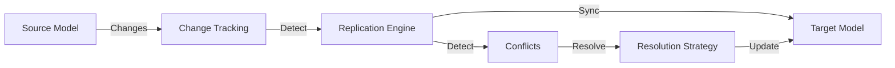
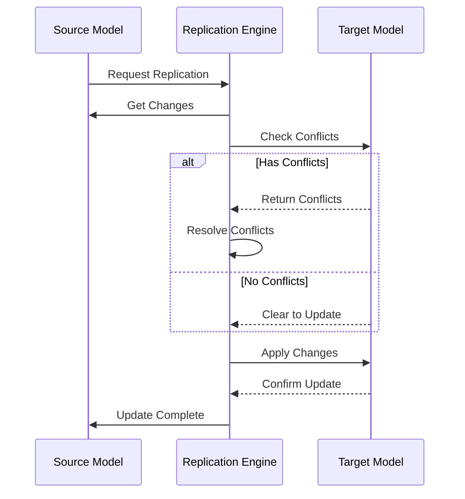
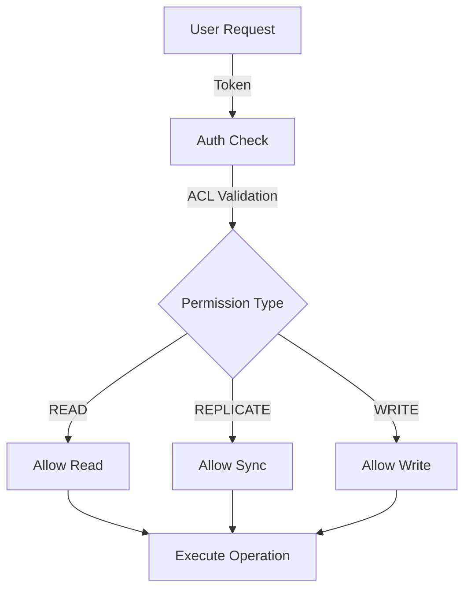
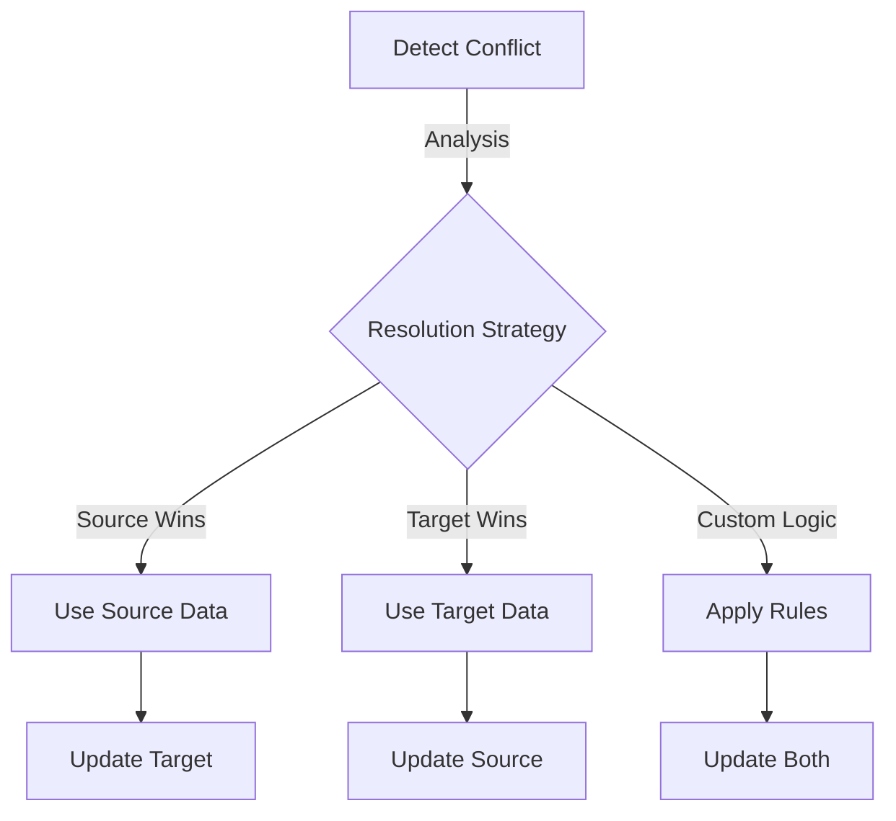

# Learnings on Replication

## Overview

Replication is a critical feature in distributed systems, allowing data to be synchronized across different nodes or services. In the context of REST APIs, replication involves copying data from one model instance to another, often across different data sources or environments. This ensures data consistency and availability across distributed systems.

## Architecture & Flow



## Replication Process



## Permission Flow



## Conflict Resolution Flow



## Key Concepts

1. **Source and Target Models**: 
   - The source model is where the data originates, and the target model is where the data is replicated to.
   - Proper configuration of these models is essential for successful replication.
   - **Example**: In a user management system, `User` could be a source model on a local server, and `RemoteUser` could be the target model on a cloud server.

2. **Conflict Resolution**:
   - Conflicts occur when there are discrepancies between the source and target data.
   - Effective conflict resolution strategies are necessary to ensure data consistency.
   - **Example**: If a user updates their profile on two different devices simultaneously, conflict resolution mechanisms determine which update should prevail.

3. **Permissions and Access Control**:
   - Different users may have varying levels of access, affecting their ability to replicate data.
   - Permissions must be carefully managed to prevent unauthorized data changes.
   - **Example**: Only admin users might have the permission to replicate sensitive data like financial records.

4. **Change Tracking**:
   - Tracking changes in the data is crucial for identifying what needs to be replicated.
   - This involves maintaining a log of changes and using it to drive the replication process.
   - **Example**: A change log might record every update to a product's price in an e-commerce system, ensuring that all replicas are updated accordingly.

## Enhanced Promise-Based Implementation

The replication system has been modernized to use Promise-based APIs with async/await for improved readability, error handling, and performance:

```javascript
// Modern Promise-based replication
async function replicateData() {
  try {
    // Create a checkpoint for tracking changes
    const checkpoint = await sourceModel.checkpoint();
    
    // Get changes since the last checkpoint
    const changes = await sourceModel.changes(lastCheckpoint);
    
    // Detect conflicts with target model
    const diff = await targetModel.diff(lastCheckpoint, changes);
    
    // Apply changes to target model
    const result = await targetModel.bulkUpdate(diff.deltas);
    
    return {
      conflicts: diff.conflicts,
      checkpoints: { source: checkpoint.seq, target: checkpoint.seq },
      updates: result.results
    };
  } catch (err) {
    console.error('Replication failed:', err);
    throw err;
  }
}
```

### Key Improvements

1. **Chunked Processing**:
   - Large datasets are now processed in smaller chunks to improve performance and reduce memory usage.
   - The `uploadInChunks` and `downloadInChunks` utilities manage this efficiently.

2. **Error Handling**:
   - Proper propagation of errors while preserving conflict information.
   - Automatic retry mechanism for intermittent failures.
   - Detailed logging for troubleshooting and debugging.

3. **Conflict Resolution**:
   - Enhanced conflict detection and resolution capabilities.
   - Clearer APIs for resolving conflicts using different strategies.

4. **Checkpoint Management**:
   - More reliable checkpoint tracking to ensure data consistency.
   - Improved resilience to checkpoint synchronization issues.

## Common Replication Methods

### Model.replicate()

The core method for initiating replication between models.

```javascript
/**
 * Replicate changes since the given checkpoint to the target model
 * @param {Model} targetModel - Target model class
 * @param {Number|Object} [since] - Since this checkpoint or object with source/target values
 * @param {Object} [options] - Options for replication
 * @param {Object} [options.filter] - Filter for which models to replicate
 * @returns {Promise<Object>} Promise resolving to replication result
 */
await sourceModel.replicate(targetModel, since, options);
```

#### Return Value:
```javascript
{
  conflicts: [], // Array of conflict objects
  checkpoints: { source: 2, target: 2 }, // New checkpoints
  updates: [] // Array of applied updates
}
```

### Model.diff()

Compare changes between source and target models to identify differences.

```javascript
/**
 * Get a set of deltas and conflicts since the given checkpoint
 * @param {Number} since - Find deltas since this checkpoint
 * @param {Array} remoteChanges - Array of change objects from remote
 * @returns {Promise<Object>} Object with deltas and conflicts
 */
await model.diff(since, remoteChanges);
```

### Model.changes()

Retrieve changes since a specific checkpoint.

```javascript
/**
 * Get changes since the specified checkpoint
 * @param {Number} since - Return only changes since this checkpoint
 * @param {Object} filter - Filter to reduce number of results
 * @returns {Promise<Array>} Array of change objects
 */
await model.changes(since, filter);
```

### Model.bulkUpdate()

Apply multiple updates in a single operation with conflict handling.

```javascript
/**
 * Apply multiple updates at once
 * @param {Array} updates - Array of update objects
 * @param {Object} options - Options for updates
 * @returns {Promise<Object>} Result with updated records and conflicts
 */
await model.bulkUpdate(updates, options);
```

## Troubleshooting Common Issues

### 1. Remote Model Not Found

**Symptoms**: Replication fails with "Cannot find model: RemoteModelName"

**Solution**:
- Ensure the remote model is properly defined with the correct name
- Check that the model is correctly attached to a datasource
- Verify that the `remoteModelName` property matches between source and target

```javascript
// Proper model setup
const RemoteModel = loopback.createModel({
  name: 'RemoteModel',
  plural: 'RemoteModels',  // Important for REST endpoints
  base: 'PersistedModel',
  properties: { /* ... */ },
  options: {
    trackChanges: true,  // Required for replication source
  }
});
```

### 2. Conflict Resolution Issues

**Symptoms**: Replication returns conflicts but resolution fails

**Solution**:
- Ensure both source and target models are properly instantiated
- Check that the conflict has valid modelId property
- Use the appropriate resolution strategy based on your requirements

```javascript
// Example conflict resolution
for (const conflict of result.conflicts) {
  try {
    // Method 1: Source wins
    await conflict.resolveUsingSource();
    
    // Method 2: Target wins
    // await conflict.resolveUsingTarget();
    
    // Method 3: Custom resolution
    // await conflict.resolveManually(customData);
  } catch (err) {
    console.error('Failed to resolve conflict:', err);
  }
}
```

### 3. Change Tracking Not Working

**Symptoms**: No changes are detected during replication

**Solution**:
- Verify `trackChanges: true` is set on the source model
- Ensure changes are properly saved and tracked with the correct checkpoint
- Check if `rectifyChange` is being called after model changes

```javascript
// Enable change tracking
Model.settings.trackChanges = true;
Model.enableChangeTracking();

// Verify changes are tracked
const changes = await Model.changes(-1);
console.log('Detected changes:', changes.length);
```

### 4. Performance Issues

**Symptoms**: Replication is slow or times out with large datasets

**Solution**:
- Configure appropriate chunk size for your data volume
- Use filters to limit the scope of replication
- Consider implementing incremental replication with smaller checkpoints

```javascript
// Configure chunk size
Model.settings.replicationChunkSize = 100; // Default is -1 (no chunking)

// Use filters for targeted replication
await sourceModel.replicate(targetModel, since, {
  filter: {
    where: {
      updatedAt: { gt: lastWeek }
    }
  }
});
```

## Advanced Topics

### Custom Change Properties

You can add custom properties to change objects to enhance filtering and conflict resolution:

```javascript
// Add tenant ID to changes for multi-tenant applications
Model.prototype.fillCustomChangeProperties = async function(change) {
  // Custom properties for change object
  if (this.tenantId) {
    change.tenantId = this.tenantId;
  }
};

// Then use the custom property in filters
Model.createChangeFilter = function(since, modelFilter) {
  const filter = {
    where: {
      checkpoint: { gte: since },
      modelName: this.modelName
    }
  };
  
  // Copy tenantId from modelFilter to change filter
  if (modelFilter?.where?.tenantId) {
    filter.where.tenantId = modelFilter.where.tenantId;
  }
  
  return filter;
};
```

### Remote Replication

For replication across servers, you need to configure the remote datasource and model appropriately:

```javascript
// Server 1: Define source model
const LocalModel = app.registry.createModel({
  name: 'LocalModel',
  base: 'PersistedModel',
  properties: { /* ... */ },
  options: { trackChanges: true }
});

// Server 2: Define remote connector
const remoteDS = loopback.createDataSource({
  connector: 'remote',
  url: 'http://server1-api/api'
});

// Server 2: Define model to receive replicated data
const RemoteModel = app.registry.createModel({
  name: 'RemoteModel',
  base: 'PersistedModel',
  properties: { /* ... */ }
});
RemoteModel.attachTo(remoteDS);

// Server 2: Replicate from remote source
async function pullChanges() {
  const result = await RemoteModel.replicate(LocalModel);
  console.log(`Replicated ${result.updates.length} changes`);
  return result;
}
```

## Error Handling Best Practices

1. **Graceful Error Recovery**:
   ```javascript
   async function replicateWithRetry() {
     const MAX_ATTEMPTS = 3;
     let attempt = 1;
     
     while (attempt <= MAX_ATTEMPTS) {
       try {
         return await sourceModel.replicate(targetModel);
       } catch (err) {
         console.error(`Replication attempt ${attempt} failed:`, err);
         if (attempt === MAX_ATTEMPTS) throw err;
         await sleep(1000 * attempt); // Exponential backoff
         attempt++;
       }
     }
   }
   ```

2. **Conflict Aggregation**:
   ```javascript
   // Collecting conflicts from multiple replication batches
   async function replicateInBatches(batchSize = 100) {
     const allConflicts = [];
     let skip = 0;
     
     while (true) {
       // Get a batch of data to replicate
       const batch = await sourceModel.find({
         limit: batchSize,
         skip: skip
       });
       
       if (!batch.length) break;
       
       // Replicate this batch
       const result = await sourceModel.replicate(targetModel, -1, {
         filter: { where: { id: { inq: batch.map(item => item.id) } } }
       });
       
       // Collect conflicts
       if (result.conflicts.length) {
         allConflicts.push(...result.conflicts);
       }
       
       skip += batchSize;
     }
     
     return allConflicts;
   }
   ```

3. **Detailed Logging**:
   ```javascript
   // Enable DEBUG logs for replication operations
   // NODE_DEBUG=loopback:persisted-model,loopback:change,loopback:model node app.js
   
   // Or programmatically:
   const debug = require('debug');
   debug.enable('loopback:persisted-model,loopback:change,loopback:model');
   ```

## Testing Replication

Effective testing is crucial for reliable replication:

```javascript
describe('Model replication', function() {
  let sourceModel, targetModel;
  
  beforeEach(async function() {
    // Set up source and target models with test data
    sourceModel = app.models.SourceModel;
    targetModel = app.models.TargetModel;
    
    // Create test data
    await sourceModel.create({ name: 'Test Instance' });
  });
  
  it('should replicate changes from source to target', async function() {
    // Execute replication
    const result = await sourceModel.replicate(targetModel);
    
    // Verify results
    expect(result.conflicts).to.have.length(0);
    
    // Verify target has the data
    const targetInstances = await targetModel.find();
    expect(targetInstances).to.have.length(1);
    expect(targetInstances[0].name).to.equal('Test Instance');
  });
  
  it('should detect and handle conflicts', async function() {
    // Create conflicting data in target
    const sourceInst = await sourceModel.findOne();
    await targetModel.create({ 
      id: sourceInst.id,
      name: 'Different Name'
    });
    
    // Execute replication
    const result = await sourceModel.replicate(targetModel);
    
    // Verify conflicts were detected
    expect(result.conflicts).to.have.length(1);
    
    // Resolve conflicts
    for (const conflict of result.conflicts) {
      await conflict.resolveUsingSource();
    }
    
    // Verify conflict resolution
    const targetInst = await targetModel.findById(sourceInst.id);
    expect(targetInst.name).to.equal(sourceInst.name);
  });
});
```

## Conclusion

Replication is a powerful feature that enables distributed data systems with strong consistency guarantees. By understanding the concepts, methods, and best practices outlined in this document, you can implement robust replication solutions that handle conflicts gracefully and maintain data integrity across your application ecosystem.

When implementing replication, focus on:
1. Proper model configuration with change tracking
2. Well-defined conflict resolution strategies
3. Efficient chunking for large datasets
4. Comprehensive error handling and recovery
5. Thorough testing of replication scenarios 