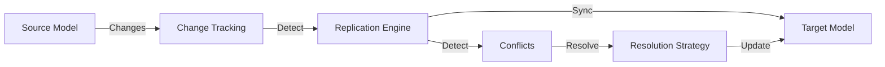
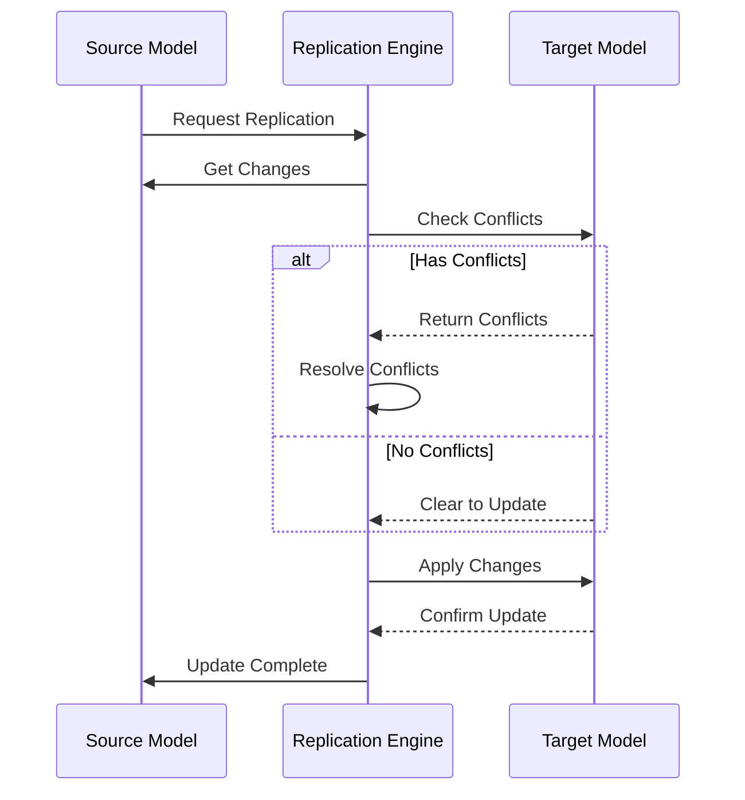
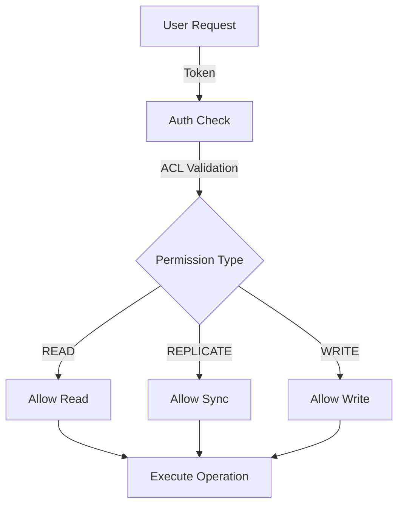
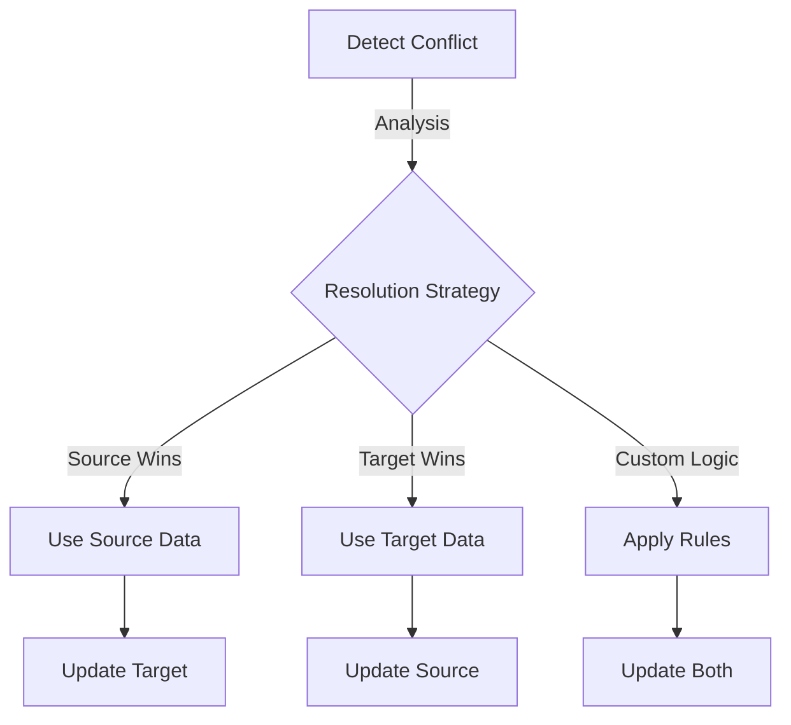

# Learnings on Replication

## Overview

Replication is a critical feature in distributed systems, allowing data to be synchronized across different nodes or services. In the context of REST APIs, replication involves copying data from one model instance to another, often across different data sources or environments. This ensures data consistency and availability across distributed systems.

## Architecture & Flow



## Replication Process



## Permission Flow



## Conflict Resolution Flow



## Key Concepts

1. **Source and Target Models**: 
   - The source model is where the data originates, and the target model is where the data is replicated to.
   - Proper configuration of these models is essential for successful replication.
   - **Example**: In a user management system, `User` could be a source model on a local server, and `RemoteUser` could be the target model on a cloud server.

2. **Conflict Resolution**:
   - Conflicts occur when there are discrepancies between the source and target data.
   - Effective conflict resolution strategies are necessary to ensure data consistency.
   - **Example**: If a user updates their profile on two different devices simultaneously, conflict resolution mechanisms determine which update should prevail.

3. **Permissions and Access Control**:
   - Different users may have varying levels of access, affecting their ability to replicate data.
   - Permissions must be carefully managed to prevent unauthorized data changes.
   - **Example**: Only admin users might have the permission to replicate sensitive data like financial records.

4. **Change Tracking**:
   - Tracking changes in the data is crucial for identifying what needs to be replicated.
   - This involves maintaining a log of changes and using it to drive the replication process.
   - **Example**: A change log might record every update to a product's price in an e-commerce system, ensuring that all replicas are updated accordingly.

## Challenges

- **Model Binding**: Ensuring that the source and target models are correctly bound and configured is a common challenge. This includes setting up the correct model names, plural forms, and ensuring that the models are aware of each other.
  - **Example**: Misconfigured model names can lead to replication failures, as the system may not recognize the target model.

- **Conflict Handling**: Designing a robust conflict resolution mechanism that can handle various scenarios, such as simultaneous updates, is complex. It requires a clear understanding of the business logic and data integrity requirements.
  - **Example**: In a banking application, resolving conflicts in transaction records requires ensuring that no duplicate transactions are processed.

- **Performance**: Replication can be resource-intensive, especially with large datasets or frequent updates. Optimizing the replication process to minimize overhead is crucial.
  - **Example**: Batch processing changes instead of real-time replication can reduce system load.

## Solutions and Best Practices

1. **Explicit Model Configuration**:
   - Always define the `remoteModelName` and ensure that the plural form is preserved across configurations.
   - Use helper functions to create consistent model options, such as `createRemoteModelOpts`.
   - **Example**: 
     ```javascript
     function createRemoteModelOpts(modelOpts) {
       return {
         ...modelOpts,
         trackChanges: false,
         enableRemoteReplication: true,
         plural: modelOpts.plural,
         remoteModelName: modelOpts.plural
       }
     }
     ```

2. **Conflict Resolution Enhancements**:
   - Implement methods like `swapParties` and `resolveUsingSource` to handle conflicts effectively.
   - Ensure that conflict instances have proper model references before attempting resolution.
   - **Example**: 
     ```javascript
     conflict.swapParties().resolveUsingTarget()
     ```

3. **Access Control Management**:
   - Use tokens and access control lists (ACLs) to manage permissions.
   - Implement checks to ensure that only authorized users can perform replication and conflict resolution.
   - **Example**: 
     ```javascript
     function setAccessToken(token) {
       clientApp.dataSources.remote.connector.remotes.auth = {
         bearer: new Buffer(token).toString('base64'),
         sendImmediately: true,
       }
     }
     ```

4. **Testing and Validation**:
   - Thoroughly test replication scenarios with different user permissions to ensure robustness.
   - Use both unit and integration tests to validate the replication logic and conflict resolution mechanisms.
   - **Example**: 
     ```javascript
     it('allows pull from server', async function() {
       const result = await RemoteCar.replicate(LocalCar, -1)
       const { conflicts } = result
       expect(conflicts).to.have.length(0)
     })
     ```

5. **Logging and Debugging**:
   - Implement detailed logging to track the replication process and identify issues.
   - Use debugging tools to step through the replication logic and resolve any errors.
   - **Example**: 
     ```javascript
     debug('Replication result:', result)
     ```

## Key Methods

1. **Change Tracking Methods**:
   ```javascript:lib/persisted-model.js
   // Get changes since checkpoint
   setRemoting(PersistedModel, 'changes', {
     description: 'Get the changes to a model since a given checkpoint.',
     accessType: 'READ',
     accepts: [
       {arg: 'since', type: 'number'},
       {arg: 'filter', type: 'object'}
     ],
     // ...
   })

   // Create/get checkpoints
   setRemoting(PersistedModel, 'checkpoint', {
     description: 'Create a checkpoint.',
     accessType: 'REPLICATE',
     // ...
   })
   ```

2. **Diff & Conflict Detection**:
   ```javascript:lib/persisted-model.js
   setRemoting(PersistedModel, 'diff', {
     description: 'Get a set of deltas and conflicts since the given checkpoint.',
     accessType: 'READ',
     accepts: [
       {arg: 'since', type: 'number'},
       {arg: 'remoteChanges', type: 'array'}
     ],
     // ...
   })
   ```

## Testing Examples

1. **Integration Testing**:
   ```javascript:test/relations.integration.js
   describe('nested relations', function() {
     before(function defineModels() {
       const Book = app.registry.createModel(
         'Book',
         {name: 'string'},
         {plural: 'books'}
       )
       // ... model setup ...
       
       // Configure nested replication
       Book.hasMany(Page, {options: {nestRemoting: true}})
       Book.hasMany(Chapter)
       // ...
     })
     // ... tests ...
   })
   ```

2. **Conflict Resolution Testing**:
   Add test cases for:
   - Model binding verification
   - Permission checks
   - Change tracking validation
   - Conflict detection and resolution

## Error Handling Best Practices

1. **Retry Logic**:
   - Implement exponential backoff for failed replication attempts
   - Use MAX_ATTEMPTS (default: 3) for replication retries
   - Accumulate conflicts during retry cycles

2. **Error Monitoring**:
   ```javascript
   // Example monitoring setup
   const metrics = {
     replicationAttempts: 0,
     conflicts: [],
     checkpointDeltas: []
   }
   
   // Track replication metrics
   function trackReplication(result) {
     metrics.replicationAttempts++
     if (result.conflicts) {
       metrics.conflicts.push(...result.conflicts)
     }
   }
   ```

3. **Checkpoint Validation**:
   - Implement sequence validation
   - Add clock skew detection
   - Verify checkpoint integrity

## Performance Optimization

1. **Batch Processing**:
   - Use bulk updates for large datasets
   - Implement change accumulation
   - Monitor memory usage patterns

2. **Monitoring Metrics**:
   - Track replication completion time
   - Monitor conflict resolution rates
   - Measure checkpoint delta times
   - Log API response times

By following these guidelines and best practices, replication can be implemented effectively, ensuring data consistency and integrity across distributed systems. This documentation serves as a comprehensive guide to understanding and implementing replication in a robust and efficient manner. 